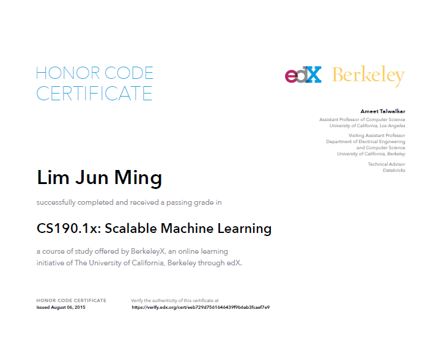

# CS100.1x & CS190.1x - Big Data & Machine Learning with Apache Spark  

These are the labs I did as part of the CS100.1x and CS190.1x MOOC.
I started with prior python experience but no apache spark knowledge.

## MOOC Details
__Site:__ [edX](https://www.edx.org/course/introduction-big-data-apache-spark-uc-berkeleyx-cs100-1x)  
__Date:__ June 2015  
__School:__ University of California, Berkeley  

## Certificate

  

## Description 
The questions are written directly into each file,  
with skeleton code underneath which we were supposed to complete.  
The original assignment templates can be found in [this repo](https://github.com/spark-mooc/mooc-setup/).  

## Environment
The code was all written in a [Jupyter](https://jupyter.org/) editor.  
We were asked to set it up with:
 * [Virtual Box](https://www.virtualbox.org/)
 * [Vagrant](https://www.vagrantup.com/)
 * [This vagrant file](https://github.com/spark-mooc/mooc-setup/blob/master/Vagrantfile).  
